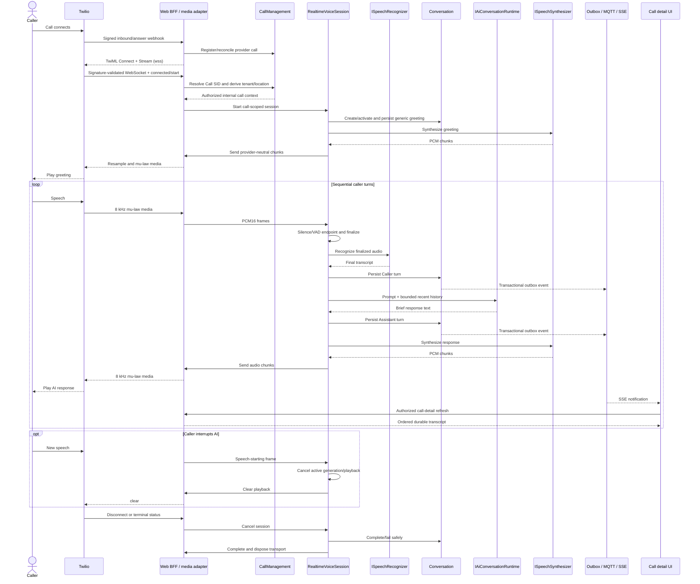

# Realtime Voice Conversation Pipeline

PurpleGlass provides a call-scoped, repeated-turn voice pipeline while preserving CallManagement, Conversation persistence, tenant isolation, and the existing realtime dashboard path. Task 16 adds the provider-neutral dental-receptionist behavior described below; it does not activate or deploy the OpenAI path.

```text
Caller
  -> Twilio Media Stream
  -> realtime audio transport
  -> speech recognition
  -> conversation history and language model
  -> speech synthesis
  -> realtime audio transport
  -> caller
```

This remains a development architecture prototype. It is not production-ready or HIPAA-ready, and a live call is optional for validation.

## Runtime ownership

The Web BFF owns active media sessions. It already owns the public, signed Twilio HTTP boundary, so it also accepts the signature-validated long-lived WebSocket at `/telephony/twilio/media`. `VoiceSessionManager` permits one active registration per internal call and creates a scoped `RealtimeVoiceSession` for the connection.

No `PurpleGlass.Voice.Worker` was added. The one-click launcher already starts the Web BFF, so Task 9 adds no launcher process or port. This keeps the first implementation small while leaving the provider-neutral runtime movable to a dedicated host later.

The browser does not connect to the media WebSocket. Twilio is the only external media client; the dashboard continues to use authenticated BFF queries and the existing SSE connection.

## Provider-neutral boundaries

Conversation application code owns the ports and provider-neutral request/result shapes:

| Capability | Port | Initial implementations |
| --- | --- | --- |
| Realtime caller/callee audio | `IRealtimeAudioTransport` | Twilio transport and deterministic fake transport |
| Speech to text | `ISpeechRecognizer` | OpenAI, deterministic fake, and disabled |
| Language model | `IAiConversationRuntime` | OpenAI, deterministic fake, and disabled |
| Text to speech | `ISpeechSynthesizer` | OpenAI, deterministic fake, and disabled |

OpenAI HTTP and Twilio protocol types remain inside adapter projects. CallManagement and Conversation domain assemblies do not reference either provider. A later Deepgram, Azure, Anthropic, Gemini, ElevenLabs, or other adapter can implement the same ports without changing the call or conversation aggregates.

The provider selector values are `Fake`, `OpenAI`, and `Disabled` (`None` is accepted as an alias for `Disabled`). Each STT, language-model, and TTS selector is independent.

## Call and media identity

Four identities remain distinct:

- `CallSessionId` is PurpleGlass's authoritative call identity.
- `ProviderCallId` is the carrier's call identity, such as a Twilio Call SID.
- `ProviderMediaStreamId` identifies one active provider media stream and remains call-scoped runtime state.
- `ConversationId` identifies the durable Conversation aggregate associated with the call.

The signed media connection supplies provider account, call, and stream identities. PurpleGlass validates their bounded shapes and the configured Twilio Account SID, then resolves the provider call identity through CallManagement. Tenant and location come only from that stored call. Twilio custom parameters and caller-supplied tenant/location values are not trusted.

An authenticated media `start` event advances the known call through legal CallManagement transitions to `Answered` and `InConversation`. This handles the race in which media begins before the separate status callback, without creating a second call lifecycle.

## Twilio audio boundary

The inbound and outbound answer webhooks return TwiML containing `<Connect><Stream>` with a `wss://` URL derived from the configured HTTPS public base URL. The WebSocket upgrade is signature-validated before acceptance. The adapter then requires Twilio's `connected` and `start` messages, supported protocol version, expected Account SID, Call SID, Stream SID, inbound track, and media format.

Twilio-specific framing and codecs remain in `PurpleGlass.Adapters.Telephony.Twilio`:

```text
Twilio inbound: 8 kHz mono mu-law/base64
    -> decode
PurpleGlass:     8 kHz mono PCM16
    -> STT adapter

TTS adapter:     streamed PCM16 deltas (OpenAI returns 24 kHz mono)
    -> stateful band-limited resample to 8 kHz
    -> mu-law encode/base64 in bounded 20 ms packets
Twilio outbound media
```

The Conversation module sees explicit `AudioFormat`, `RealtimeAudioFrame`, finalized utterance, and synthesized chunk types; it does not see Twilio JSON events, stream SIDs, base64 payloads, or mu-law assumptions. JSON messages, encoded payloads, decoded media, PCM chunks, and outbound frames all have configured size bounds.

### Task 16.1 streaming playback

Before Task 16.1, the OpenAI speech adapter materialized the complete PCM response and the Twilio transport accumulated every PCM chunk before resampling. Playback could therefore begin only after both full-response waits. The Task 16 production evidence measured LLM completion at approximately 0.60–3.51 seconds (median approximately 1.04 seconds), TTS completion at approximately 0.82–4.79 seconds (median approximately 1.53 seconds), and model completion to first audible media at approximately 1.0–2.4 seconds with one approximately 5.3-second outlier. Caller-perceived pauses could reach roughly 3–6 seconds or longer.

The OpenAI adapter now consumes the installed official SDK's streaming speech API and emits each valid raw-PCM audio delta through the provider-neutral `ISpeechSynthesizer` stream. A bounded four-update channel decouples provider receipt from paced carrier delivery without allowing unbounded send-ahead. The finalized assistant text remains one durable Assistant turn; audio deltas are never persisted as conversation content.

Each response owns one `StreamingPcm16Resampler`. It carries a split PCM16 byte across provider deltas, retains filter lookahead/history across arbitrary chunk boundaries, performs the existing windowed-sinc low-pass conversion from 24 kHz to 8 kHz, and flushes the mathematically rounded final sample count exactly once. It adds no capacity padding, duplicate tail, synthetic silence, or per-delta filter reset. The resulting μ-law bytes accumulate to the current bounded 280 ms startup reserve and are framed as fourteen 20 ms/160-byte carrier packets. Those initial packets establish bounded Twilio send-ahead; later packets follow the monotonic low/high-water reserve controller. A provider response mark is sent only after the final resampler flush and final media packet.

Work required before the first carrier media packet is now: finalized assistant response persistence, OpenAI TTS request startup, receipt of enough PCM for the resampler's bounded lookahead, conversion/μ-law encoding, and confirmation of media readiness. Remaining TTS deltas, final conversion, later paced media packets, the response mark, and mark acknowledgement happen after the first media packet. This structural change removes full-TTS and full-resample buffering from the critical path; it does not claim a measured production improvement until a controlled later deployment validates it.

The authenticated Twilio `connected` and `start` messages establish the current stream SID before the session is created. `IRealtimeAudioTransport.WaitForMediaReadyAsync` makes that boundary explicit to the session. Greeting synthesis may run concurrently, but its bounded updates are held until that signal completes; playback is released once through the same response path used by later turns. Session cancellation, provider disconnect, or startup timeout cancels that wait and the TTS stream without regenerating or duplicating the greeting. No synchronization sleep is used.

### Task 16.1.2 playback quality hardening

The controlled Task 16.2 call proved streaming, greeting readiness, and barge-in, but a human heard a recurring cut/restart at response beginnings and intermittent jitter. No production audio was retained, so the precise audible waveform cannot be reproduced or attributed conclusively. Deterministic stage-by-stage tests do prove that owned OpenAI PCM deltas, PCM16 carry reconstruction, stateful resampling, μ-law conversion, and packet extraction preserve one contiguous byte sequence with no duplicate prefix or tail. The resampler exposes numeric-only diagnostics for input bytes/samples, chunk count, carry, history, output offsets, and final-flush output; it never records sample values.

The first software discontinuity found was transport scheduling. The previous 100 ms packet was sent on a zero-margin playback cadence. If a provider delta or scheduler continuation arrived after its old absolute deadline, buffered packets could all qualify immediately and be sent in a catch-up burst; a longer producer gap could exhaust Twilio's ordered playback buffer. The corrected transport keeps the same explicit 100 ms startup reserve but frames it as five 20 ms packets. It then paces from monotonic deadlines, rebases the next deadline after more than 40 ms lateness, and never drains several overdue packets merely to catch up. If the estimated Twilio reserve is exhausted, the generation records one underflow and accumulates a new bounded 100 ms reserve before resuming. A final response shorter than the threshold is still flushed completely.

The quality buffer adds no designed startup delay relative to the prior 100 ms first-packet threshold: both require 100 ms of converted audio before normal non-final playback. It increases initial WebSocket framing from one message to five and improves pacing, cancellation, and `clear` granularity from 100 ms to 20 ms. Streaming remains response-incremental; the whole TTS response is never buffered. Cancellation and `clear` dispose the response-scoped resampler and all pending μ-law bytes, and the next generation creates independent pacing state. Safe response-level telemetry reports packet duration, startup/max buffered duration, packet count, underflow count, and average/maximum pacing lateness without packet payloads or per-packet log volume.

Endpoint telemetry now measures `last speech-bearing inbound frame -> endpoint detected` explicitly. VAD and trailing-silence thresholds are unchanged: the production-proven natural-pause behavior is preserved. STT, LLM, and TTS provider choices are also unchanged. The local hardening is not evidence that the human-audible defects are fixed; that requires one controlled production revalidation from the exact candidate SHA.

### Task 16.1.3 remote-reserve correction

The controlled deployment of `8445bf14ad06da4c167f91c4f5218d4b92e5a7ea` failed audio-quality validation: the tester heard frequent cutoffs, and every completed response reported one or more underflows (17 total). Maximum reported lateness clustered near 80 ms. The initial five-packet burst did put 100 ms of audio in Twilio's ordered playback queue; the reserve was therefore remote, not merely a 100 ms local queue threshold. The defect was in steady state. After a late send depleted part of that reserve, deadline rebasing scheduled future packets without restoring the lost send-ahead. The reduced reserve persisted until a later delay exhausted it.

The old accounting also obscured the transition. Its lateness timestamp was captured after `WebSocket.SendAsync`, so scheduler wake delay and wire-send duration were combined. Underflow was checked mainly when a later provider delta entered the transport, while the implicit restart path exposed no separate rebuffer count. An empty terminal provider update could consequently observe an exhausted playback timeline even though no audio remained, inflating underflow telemetry without representing an audible starvation episode.

The authoritative response state is now:

- `BufferedMuLawBytes` is local, converted, unsent audio only.
- `bufferedUntilTimestamp` is the estimated end of media actually sent to Twilio, measured from the first completed media send and reset with the response on cancellation/clear.
- estimated remote reserve is `max(0, bufferedUntilTimestamp - now)`; local queued audio is never included.
- `nextPacketTargetTimestamp` is the monotonic scheduler deadline, bounded by the remote-reserve target.
- scheduler lateness, producer starvation, remote-buffer exhaustion, and WebSocket send duration are independent observations.
- one starvation episode can create at most one remote-underflow count and one rebuffer completion.

Startup still requires 100 ms of real converted audio for a non-final response, then transmits five 20 ms packets promptly so Twilio owns the reserve before steady pacing. A final response shorter than 100 ms uses its complete real-audio length as the bounded startup target. During steady state, a late completion computes the remaining Twilio reserve and sends only the whole packets required to restore it, never exceeding the 100 ms target. This is reserve repair, not unbounded deadline catch-up. If the remote reserve reaches zero because the provider has not supplied audio, playback waits for a fresh 100 ms local threshold; the rebuilt reserve is then sent once before normal pacing resumes. A final short tail rebuilds only its available real-audio duration. No synthetic silence is inserted.

Completion sends the mark only after all source PCM, final resampler output, μ-law bytes, and real media packets have been sent. An empty final update after playback naturally drains is not classified as underflow. Generation cancellation during startup, pacing, starvation, or rebuffer disposes the response state; `clear` invalidates both local audio and the old remote-reserve estimate, and the next response begins independently.

The response-level pacing summary now reports scheduler-late count and average/maximum scheduler lateness, producer-starvation count, remote-buffer-underflow count, rebuffer count and total duration, initial reserve, minimum/maximum estimated remote reserve, and maximum WebSocket send duration. These remain numeric, bounded-cardinality values. No packet payload, PCM, transcript, prompt, or response text is logged. Deterministic tests establish the state transitions locally; they do not claim that production audio is corrected until another controlled call validates the new exact SHA.

### Task 16.1.4 proactive low/high-water reserve

The `912526db3ab35e65df6edbf6476a490a06733456` candidate completed conversations but failed the human audio-quality gate: jitter was audible near response starts and playback became more stable later. Ten completed responses emitted 2,087 packets and recorded 426 scheduler-late events, approximately 12.456 ms weighted average scheduler lateness, approximately 161.257 ms maximum scheduler lateness, approximately 76.115 ms maximum WebSocket-send duration, 18 producer-starvation events, and 75 remote underflows/rebuffers totaling approximately 2,505 ms. Every completed response exhausted the 100 ms estimate. This proves that the former target and after-zero repair policy were insufficient; it does not prove the new policy fixes production audio.

The replacement uses packet-aligned `startup=280 ms`, `low water=140 ms`, `high water=280 ms`, and `hard maximum send-ahead=300 ms`, while retaining 20 ms/160-byte packets. Scheduler lateness and send duration can compound because Twilio consumes queued media while the control task is asleep and again while `WebSocket.SendAsync` is awaited. Including the ordinary 20 ms control interval, the measured budget is `20 + 161.257 + 76.115 = 257.372 ms`; high water therefore leaves approximately 22.628 ms, slightly more than one packet, of measured margin. The 300 ms ceiling bounds interruption exposure. Crossing 140 ms enters one hysteretic proactive-refill state and sends available real packets toward 280 ms without waiting for zero. The state remains active until the deficit is repaired, and paced deadlines rebase from the actual send start instead of chasing obsolete history.

One response-generation-scoped playback deadline is authoritative. It represents only successfully sent μ-law duration minus elapsed monotonic playback time and is clamped to zero. Local PCM, resampler output, queued μ-law, packets whose sends have not completed, canceled or cleared media, and previous generations never contribute. Reserve continues to elapse during the WebSocket await; the successfully sent packet duration is added only at actual completion. A pre-send bound prevents the next packet from exceeding 300 ms. Cancellation, generation replacement, Twilio `clear`, completion, and disposal discard the old reserve/refill/rebuffer state.

Startup accumulates 280 ms of real converted audio, then sends fourteen packets promptly. A completed response shorter than that target sends all available real audio and marks without waiting or synthesizing silence. In steady state, low water starts proactive refill before exhaustion. Genuine zero reserve while more audio is expected begins exactly one rebuffer episode, stops steady delivery, records its start, and accumulates real audio toward 280 ms; a completed short tail resumes at its available bound. Normal completion, an empty terminal update, cancellation, clear, or a response with no further media is not an underflow. Barge-in still invalidates generation, cancels TTS and media waits, discards local audio, serializes `clear`, resets reserve, and ignores stale marks.

The startup increase from 100 ms to 280 ms has an exact deterministic accumulation cost of 180 ms. It does not restore full-response buffering: production-like fake streams emit first Twilio media after the first 280 ms of converted audio and before long-response TTS completion. Response-level telemetry now includes packet duration/count, startup/low/high/maximum thresholds, scheduler count and average/maximum lateness, average/maximum send duration, proactive-refill count, producer-starvation count, remote-underflow count, rebuffer count/duration, and minimum/maximum estimated reserve. It remains numeric and bounded; packet-level production logs, audio, Base64, text, phone numbers, credentials, patient data, arbitrary provider bodies, and high-cardinality metric labels remain prohibited.

## Turn detection and backpressure

The transport feeds a bounded audio channel. A single detector consumes frames, suppresses duplicate or out-of-order sequence numbers, checks PCM16 energy, and finalizes an utterance on one of these signals:

- an explicit end-of-utterance signal;
- configured trailing silence (`Voice:EndOfUtteranceSilence`); or
- configured maximum utterance duration.

Only finalized utterances enter the bounded utterance channel. The default capacities are 100 audio frames and four finalized utterances. Both channels wait when full instead of allocating unbounded memory. One single-reader turn processor runs STT, persistence, LLM, persistence, TTS, and audio delivery sequentially, so two caller turns cannot produce out-of-order AI responses.

An inactivity limit, maximum session duration, maximum turns, maximum utterance bytes, maximum history turns, model-output token limit, and response-character limit prevent accidental infinite development calls. Voice responses are whitespace-normalized and shortened at a sentence or word boundary before persistence and synthesis.

## Conversation and greeting

On connection, the runtime creates or reuses the one Conversation aggregate for the authorized call and activates it. A configured, voice-friendly greeting is persisted as an Assistant turn and synthesized. The committed default is neutral because no trusted dental-location display name is configured:

> Thank you for calling our dental office. How can I help you today?

`DentalAgentBehavior` in the Conversation application layer constructs the trusted behavior independently of the selected LLM provider. It identifies the assistant as the virtual receptionist for the current PurpleGlass dental location and identifies the interaction as a phone call. Responses should ordinarily be one to three short spoken sentences, acknowledge the caller, use recent history, and ask one primary question at a time. Caller-facing output must be plain speech without Markdown, headings, tables, lists, emoji, or generic text-message acknowledgements. The opening greeting is not repeated on later turns.

### Trusted context and caller input

The behavior builder receives only the bounded `ConversationRuntimeConfiguration`: configured language, optional office display name, optional office hours/address, approved safety keywords, and an optional trusted configuration instruction. Values equal to `not configured` are explicitly treated as unavailable and are not presented as facts. The committed realtime configuration has no office name, hours, or address; the assistant must say it does not have an unavailable fact rather than invent one.

Each `AiResponseRequest` keeps this trusted `ConversationAgentBehavior` separate from `CurrentCallerTurn` and the bounded `ExistingTurns`. Caller speech—including a request to ignore instructions—is always mapped as a caller/user message, never appended to trusted instructions. Durable transcript queries remain tenant-scoped, and the behavior request contains no database entity dump, internal tenant/location identifiers, or other tenant's context.

The OpenAI adapter maps the already-built application instructions and provider-neutral Caller/Assistant messages into the Responses API. It does not own dental policy. The deterministic implementation follows the same behavioral boundary with stable, credential-free responses for appointment intake, dental concerns, office facts, insurance, billing, privacy, and human-assistance requests.

### Conversation authority and future tools

The receptionist may understand caller intent, maintain a multi-turn conversation, generate short spoken responses, and gather simple intake details. It recognizes new and existing appointment questions, rescheduling, cancellation, dental concerns, office information, insurance, billing, general questions, requests for a person, and urgent concerns.

Conversation intelligence does not grant business authority. No business-action tools are enabled. The receptionist cannot search live availability; book, cancel, or reschedule appointments; search or modify patient records; verify insurance coverage or eligibility; read balances; process payments; transfer a call; or execute Open Dental operations. It must not imply that any of those actions occurred. It also must not fabricate practice facts, patient data, coverage, prices, balances, staff availability, transfer status, diagnoses, prescriptions, or clinical urgency.

Configured urgent keywords remain the only approved escalation policy. When none are configured, the behavior explicitly forbids inventing emergency routing or claiming to assess urgency. A future tool task may grant individual capabilities through a reviewed application boundary; it must not bury action authority inside a provider prompt or adapter.

For each finalized caller utterance:

1. STT returns a final transcript.
2. The Caller turn is durably persisted with deterministic turn identity and ordering.
3. The LLM receives the configured system instructions plus the bounded recent Caller/Assistant history.
4. The response is constrained for spoken output.
5. The Assistant turn is durably persisted.
6. TTS streams PCM deltas; the stateful transport converts and sends valid audio incrementally, then sends one final response mark.

Partial STT results and raw provider messages are not persisted. Only finalized Caller and Assistant text uses the existing Conversation transcript model.

## Configurable and adaptive call language

One bounded registry in SharedKernel is authoritative for language codes and capabilities. The initial entries are `en-US` (English), `es-US` (Spanish), and `es-PR` (Spanish for Puerto Rico); English is the system fallback. Each entry carries its normalized code, display name, STT recognition code, agent language name, one localized greeting, and fallback. API and persistence boundaries normalize known aliases but reject arbitrary language strings. Adding a future supported language extends the registry and provider compatibility rather than creating another conversation pipeline or database column.

Starting language is resolved before greeting synthesis. A validated outbound per-call override wins; otherwise the active tenant/location's persisted default is used; missing or invalid legacy configuration falls back to `en-US`. Inbound calls always use the resolved location default. The call persists the resolved starting code and `call_override`, `location_default`, or `fallback` reason. The Conversation then persists starting language, current language, reason, change time, optional operational confidence, and a monotonic language-change sequence. A switch appends one deterministic, idempotent event row to the same tenant-scoped Conversation; it never resets transcript history or creates a new Conversation.

The practical precedence is:

1. a supported explicit caller request changes the current language immediately;
2. a validated per-call override selects the startup language;
3. repeated automatic evidence may change the current language later;
4. the location default supplies startup when no override exists; and
5. `en-US` is the system fallback.

The startup override does not pin the call. Explicit intent such as “Speak Spanish” or “Háblame en inglés” resets automatic evidence and switches immediately. A repeated request for the already-active language is idempotent. A bounded unsupported request retains the current language and produces a polite current-language response that names English and Spanish. Language diagnostics record only normalized codes, bounded reason/result values, a confidence bucket, evidence count, accepted/rejected state, and version—never the caller's words.

Automatic switching is deterministic application policy, not prompt behavior and not OpenAI adapter state. A caller must provide two consecutive alternate-language utterances that are at least four words and 16 characters. When confidence exists, it must be at least `0.75`. Empty detection, low confidence, multiple detected languages, short acknowledgements, and name/address context reset or reject evidence. Mixed English/Spanish (Spanglish) therefore remains in the current language unless later single-language turns satisfy the threshold; PurpleGlass does not produce word-by-word bilingual output. After any switch, two meaningful turns form a cooldown and automatic reversal requires three qualifying turns. An explicit request can always switch immediately.

For OpenAI STT, `gpt-transcribe` completed-audio streaming returns the final transcript and detected language codes in the same `/v1/audio/transcriptions` request. The adapter omits a forced language hint on that path so detection remains possible, parses only the bounded final SSE event, and maps provider metadata to `SpeechRecognitionResult`. Configured older transcription models retain the existing one-request JSON path and active-language hint but may not expose detected-language metadata; in that case automatic switching waits while explicit switching continues to work. No second language-detection model call is made. Detection accuracy remains provider-dependent, especially for short or mixed-language speech.

The active state is read for every stage: it selects the greeting, STT configuration, agent behavior/instructions, response configuration, fallback wording, and TTS language. A language request processed after barge-in uses the existing generation cancellation and `clear` boundary: old TTS, unsent media, pacing reserve, and stale marks are invalidated before the new-language response. The voice/model/transport implementation remains single-pipeline and provider-neutral; packetization, resampling, buffering, media readiness, marks, and playback thresholds do not vary by language.

Administrative location-default changes use the existing tenant/location authorization, optimistic version, outbox, and audit transaction. Audit retains actor, tenant/location, time, and bounded old/new normalized codes. Call-level detections use bounded metrics and Conversation events rather than the administrative audit stream. Counters cover starting language, explicit/automatic switches, rejected evidence, and unsupported requests with registry-bounded labels only.

## Interruption and cancellation

When new caller speech begins while the runtime is `Thinking` or `Speaking`, it invalidates the active response generation, cancels the linked LLM/TTS/send operation, invokes `IRealtimeAudioTransport.ClearPlaybackAsync`, publishes `Interrupted`, and continues detecting the new caller turn. The Twilio send and clear operations share a serialization gate: incomplete resampler state and unsent μ-law data are discarded before `clear`, pending marks are cleared, and no old-generation media or mark can be written afterward. A later response always creates independent synthesis, resampler, pacing, and mark state.

One linked session cancellation tree covers receive, turn detection, STT, LLM, TTS, and audio send. Cancellation is triggered by:

- caller/provider disconnect;
- a terminal signed provider status;
- an authorized PurpleGlass hangup request;
- application shutdown;
- maximum session duration; or
- a fatal media/session error.

Hangup still creates the durable Task 8 telephony operation. Requesting it also stops the in-process voice session immediately; the signed provider callback remains authoritative for final call state.

## Timeouts, retries, and failure handling

STT, LLM, TTS, media initialization, and cleanup have bounded timeouts. Provider operations default to one attempt and allow at most two immediate attempts when explicitly configured and the adapter classifies the failure as retryable. There is no delayed outbox-style retry during a live turn.

Adapters map authentication, rejection, rate-limit, timeout, network, invalid-response, and response-size failures to bounded application codes and safe messages. A failed turn publishes the safe `Failed` state. When the failure is not in TTS itself, PurpleGlass makes a best-effort attempt to say:

> I'm sorry, I'm having trouble responding right now.

Fatal protocol, media, identity, lifecycle, or session failures close the stream, cancel outstanding work, and fail or complete the Conversation safely. Raw provider responses and exception details are not exposed to the caller or dashboard.

## Durable transcript and realtime UI

Finalized Caller and Assistant turns are saved through `ConversationService` in the existing transaction and outbox. Their `user-speech-recognized` and `ai-response-generated` events follow the established path:

```text
Conversation transaction
  -> outbox
  -> integrations worker
  -> MQTT call topic
  -> Web BFF tenant/location subscription
  -> browser SSE
  -> RTK Query call-detail invalidation
  -> authorized transcript query
```

Transient `Listening`, `Thinking`, `Speaking`, `Interrupted`, and `Failed` states are not persisted. The BFF publishes a sanitized `voice-state-changed` event containing only internal call ID, bounded state, and optional safe code. The existing frontend EventSource stores that state only for the selected call. It creates neither a second browser store nor another browser socket.

## Sequence



## Security and tenant isolation

- Twilio HTTP webhooks and the media WebSocket require `X-Twilio-Signature` validation against the exact configured public URL.
- The media route has a concurrency rate limit and accepts WebSocket upgrades only.
- Connected/start messages, SIDs, account identity, protocol version, track, media format, sequence values, JSON size, and audio size are validated before use.
- Unknown, terminal, mismatched, or duplicate active calls are rejected with bounded policy close reasons.
- Tenant and location are derived from the stored provider-qualified call, never from media custom parameters or query input.
- Browser transcript access remains behind BFF authentication, `ViewTranscripts`, and tenant/location scoping. Hangup remains authenticated, authorized, CSRF-protected, rate-limited, and audited.
- No API key, Twilio token, signature, raw audio, prompt, transcript, or model response is written to operational logs.

## Observability

The trace shape uses the existing call `ActivitySource`:

```text
voice.session
  voice.turn
    speech.recognize
    ai.generate
    speech.synthesize
    audio.send
  audio.receive
```

Structured monotonic latency events correlate a safe internal call/conversation/turn/response identity and record stage, duration, elapsed time from endpoint, adapter, and bounded result code. Stages include endpoint finalization; STT start/completion; caller persistence start/end; LLM start/completion; assistant persistence start/end; TTS start/first audio/completion; and first Twilio media. Existing playback diagnostics cover first media, final media, mark sent, acknowledgement, clear, and cancellation. A provider API that does not expose a useful first STT or LLM datum does not fabricate one.

Metrics include active voice sessions, completed voice turns, turn duration, interruptions, failures, voice endpoint latency, STT duration, LLM duration, TTS time-to-first-audio and total duration, first-audio transport delay, endpoint-to-first-media, and total turn latency. Metric dimensions are limited to low-cardinality provider, result, direction, language, or adapter values.

Call, conversation, correlation, and provider stream identities may be used for operational correlation where the existing tracing policy permits them, but never as metric dimensions. Telemetry must not contain caller speech, transcript text, AI text, prompts, audio, phone numbers, patient data, credentials, tokens, raw provider payloads, or full exception messages.

Provider WebSocket callbacks do not fabricate W3C ancestry. Business call/correlation identity associates work when no remote trace context exists.

## Remaining latency and scope boundaries

Task 16.1 does not change external OpenAI Responses latency, external speech startup latency, telephone G.711 bandwidth, Render free-tier cold starts/resource contention, the finalized-utterance STT architecture, VAD thresholds, or process-local ownership of active media sessions. It does not pipeline partial LLM text into TTS, add filler speech, scheduling, patient lookup, tools, RAG, transfer, or provider-side authoritative conversation state. Endpointing and STT remain separately measurable so a later live validation can identify their actual contribution without weakening the hardened turn detector.

## Configuration

### Credential-free Development

These are the committed and one-click-launcher defaults:

```text
Providers__EnableRealAI=false
Providers__EnableRealSpeech=false
SpeechToText__Provider=Fake
LanguageModel__Provider=Deterministic
TextToSpeech__Provider=Fake
```

Use `Disabled` instead of `Deterministic` for the language model, or instead of `Fake` for either speech selector, to exercise safe provider-disabled behavior. The application starts without an OpenAI credential when the language model is `Deterministic`. `Fake` remains accepted as a backwards-compatible language-model alias. The one-click launcher also sets real telephony off and `Telephony__Provider=None`; it needs no new Task 9 process.

Relevant bounded voice settings are:

```text
Voice__Conversation__Language=en-US
Voice__Conversation__VoiceId=alloy
Voice__Conversation__SpeakingRate=1.0
Voice__Conversation__MaximumTurns=30
Voice__Conversation__MaximumDuration=00:30:00
Voice__Conversation__MaximumHistoryTurns=12
Voice__Conversation__MaximumOutputTokens=160
Voice__Conversation__MaximumResponseCharacters=400
Voice__Conversation__InactivityTimeout=00:00:30
Voice__EndOfUtteranceSilence=00:00:00.500
Voice__MaximumUtteranceDuration=00:00:20
Voice__RecognitionTimeout=00:00:15
Voice__LanguageModelTimeout=00:00:15
Voice__SynthesisTimeout=00:00:15
Voice__CleanupTimeout=00:00:03
Voice__MaximumProviderAttempts=1
Voice__SpeechEnergyThreshold=500
Voice__AudioQueueCapacity=100
Voice__UtteranceQueueCapacity=4
Voice__MaximumAudioBytesPerUtterance=640000
```

### Development-only OpenAI path

LLM text generation uses the official `OpenAI` .NET SDK and its asynchronous `OpenAI.Responses.ResponsesClient` surface. The client is reused as a singleton, SDK retries are disabled so they cannot stack with the voice pipeline retry/timeout budget, tools are not configured, and provider-side conversation continuation is not used. Each finalized caller turn rebuilds a bounded, ordered context from PurpleGlass's tenant-scoped durable transcript. Known model failures produce one deterministic fallback through the normal assistant-turn persistence and TTS path.

Real AI and speech are explicit Development-only opt-ins. First store credentials outside the repository from `AI Call Center`:

```powershell
$webBffProject = 'src\backend\Hosts\PurpleGlass.WebBff\PurpleGlass.WebBff.csproj'
dotnet user-secrets set 'OpenAI:ApiKey' '<development OpenAI key>' --project $webBffProject
```

For a real Twilio media call, store its credentials the same way:

```powershell
$webBffProject = 'src\backend\Hosts\PurpleGlass.WebBff\PurpleGlass.WebBff.csproj'
dotnet user-secrets set 'Telephony:Twilio:AccountSid' '<development Twilio Account SID>' --project $webBffProject
dotnet user-secrets set 'Telephony:Twilio:AuthToken' '<development Twilio auth token>' --project $webBffProject
```

Then set non-secret provider choices and safety switches in the process environment:

```powershell
$env:ASPNETCORE_ENVIRONMENT = 'Development'
$env:Providers__EnableRealAI = 'true'
$env:Providers__EnableRealSpeech = 'true'
$env:SpeechToText__Provider = 'OpenAI'
$env:LanguageModel__Provider = 'OpenAI'
$env:TextToSpeech__Provider = 'OpenAI'
$env:OpenAI__BaseUrl = 'https://api.openai.com/v1/'
$env:OpenAI__LanguageModel = 'gpt-4o-mini'
$env:OpenAI__TranscriptionModel = 'gpt-4o-mini-transcribe'
$env:OpenAI__SpeechModel = 'gpt-4o-mini-tts'
```

The complete real-call path additionally needs the Task 8 telephony opt-in:

```powershell
$env:Providers__EnableRealTelephony = 'true'
$env:Telephony__Provider = 'Twilio'
$env:Telephony__PublicBaseUrl = 'https://<development-public-host>'
```

`Telephony__PublicBaseUrl` must be the exact HTTPS public origin that reaches the Web BFF; PurpleGlass derives the `wss://` media URL from it. Do not commit real keys, tokens, SIDs, phone numbers, or tunnel URLs. The standard one-click launcher deliberately overrides real-provider switches to false and selectors to fake/none, so run the Web BFF manually with an explicit Development environment for optional live validation.

Remove local secrets when finished:

```powershell
$webBffProject = 'src\backend\Hosts\PurpleGlass.WebBff\PurpleGlass.WebBff.csproj'
dotnet user-secrets remove 'OpenAI:ApiKey' --project $webBffProject
dotnet user-secrets remove 'Telephony:Twilio:AccountSid' --project $webBffProject
dotnet user-secrets remove 'Telephony:Twilio:AuthToken' --project $webBffProject
```

## Cleanup and current limitations

Session shutdown cancels linked operations, completes bounded channels, clears active operation ownership, asks the transport to complete, disposes the transport, removes the manager registration, and decrements the active-session metric. Application shutdown requests cancellation for every registered session.

Current limitations are intentional:

- Active sessions are in one Web BFF process. Horizontal scaling requires connection affinity or external session routing.
- There is no media-stream resume or migration after process failure or deployment.
- A disconnected stream is not reconstructed from durable transcript state.
- OpenAI STT is finalized-utterance HTTP transcription, not streaming partial transcription.
- OpenAI TTS is divided into bounded chunks after the provider response; upstream provider streaming can be added later.
- Language is configured per session; automatic language detection/switching is not implemented.
- Multi-provider failover, transfer, recording, and human-agent features are not implemented.
- Business-action tool execution is not implemented: there is no patient lookup, appointment action, insurance workflow, Open Dental access, RAG, or other authoritative dental capability.

See [ADR 0010](../adr/0010-realtime-voice-conversation-pipeline.md) for the decision and tradeoffs.
