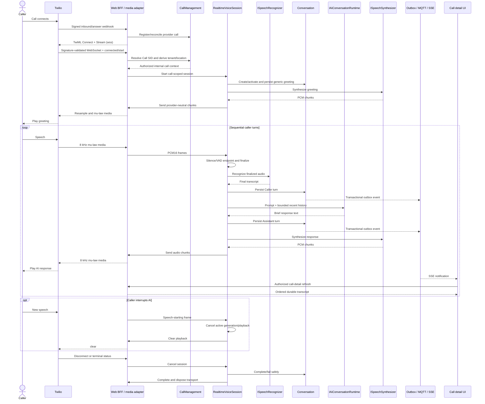

# Realtime Voice Conversation Pipeline

PurpleGlass Task 9 adds a call-scoped, repeated-turn voice pipeline while preserving CallManagement, Conversation persistence, tenant isolation, and the existing realtime dashboard path.

```text
Caller
  -> Twilio Media Stream
  -> realtime audio transport
  -> speech recognition
  -> conversation history and language model
  -> speech synthesis
  -> realtime audio transport
  -> caller
```

This remains a development architecture prototype. It is not production-ready or HIPAA-ready, and a live call is optional for validation.

## Runtime ownership

The Web BFF owns active media sessions. It already owns the public, signed Twilio HTTP boundary, so it also accepts the signature-validated long-lived WebSocket at `/telephony/twilio/media`. `VoiceSessionManager` permits one active registration per internal call and creates a scoped `RealtimeVoiceSession` for the connection.

No `PurpleGlass.Voice.Worker` was added. The one-click launcher already starts the Web BFF, so Task 9 adds no launcher process or port. This keeps the first implementation small while leaving the provider-neutral runtime movable to a dedicated host later.

The browser does not connect to the media WebSocket. Twilio is the only external media client; the dashboard continues to use authenticated BFF queries and the existing SSE connection.

## Provider-neutral boundaries

Conversation application code owns the ports and provider-neutral request/result shapes:

| Capability | Port | Initial implementations |
| --- | --- | --- |
| Realtime caller/callee audio | `IRealtimeAudioTransport` | Twilio transport and deterministic fake transport |
| Speech to text | `ISpeechRecognizer` | OpenAI, deterministic fake, and disabled |
| Language model | `IAiConversationRuntime` | OpenAI, deterministic fake, and disabled |
| Text to speech | `ISpeechSynthesizer` | OpenAI, deterministic fake, and disabled |

OpenAI HTTP and Twilio protocol types remain inside adapter projects. CallManagement and Conversation domain assemblies do not reference either provider. A later Deepgram, Azure, Anthropic, Gemini, ElevenLabs, or other adapter can implement the same ports without changing the call or conversation aggregates.

The provider selector values are `Fake`, `OpenAI`, and `Disabled` (`None` is accepted as an alias for `Disabled`). Each STT, language-model, and TTS selector is independent.

## Call and media identity

Four identities remain distinct:

- `CallSessionId` is PurpleGlass's authoritative call identity.
- `ProviderCallId` is the carrier's call identity, such as a Twilio Call SID.
- `ProviderMediaStreamId` identifies one active provider media stream and remains call-scoped runtime state.
- `ConversationId` identifies the durable Conversation aggregate associated with the call.

The signed media connection supplies provider account, call, and stream identities. PurpleGlass validates their bounded shapes and the configured Twilio Account SID, then resolves the provider call identity through CallManagement. Tenant and location come only from that stored call. Twilio custom parameters and caller-supplied tenant/location values are not trusted.

An authenticated media `start` event advances the known call through legal CallManagement transitions to `Answered` and `InConversation`. This handles the race in which media begins before the separate status callback, without creating a second call lifecycle.

## Twilio audio boundary

The inbound and outbound answer webhooks return TwiML containing `<Connect><Stream>` with a `wss://` URL derived from the configured HTTPS public base URL. The WebSocket upgrade is signature-validated before acceptance. The adapter then requires Twilio's `connected` and `start` messages, supported protocol version, expected Account SID, Call SID, Stream SID, inbound track, and media format.

Twilio-specific framing and codecs remain in `PurpleGlass.Adapters.Telephony.Twilio`:

```text
Twilio inbound: 8 kHz mono mu-law/base64
    -> decode
PurpleGlass:     8 kHz mono PCM16
    -> STT adapter

TTS adapter:     PCM16 chunks (OpenAI currently returns 24 kHz mono)
    -> resample to 8 kHz when required
    -> mu-law encode/base64
Twilio outbound media
```

The Conversation module sees explicit `AudioFormat`, `RealtimeAudioFrame`, finalized utterance, and synthesized chunk types; it does not see Twilio JSON events, stream SIDs, base64 payloads, or mu-law assumptions. JSON messages, encoded payloads, decoded media, PCM chunks, and outbound frames all have configured size bounds.

## Turn detection and backpressure

The transport feeds a bounded audio channel. A single detector consumes frames, suppresses duplicate or out-of-order sequence numbers, checks PCM16 energy, and finalizes an utterance on one of these signals:

- an explicit end-of-utterance signal;
- configured trailing silence (`Voice:EndOfUtteranceSilence`); or
- configured maximum utterance duration.

Only finalized utterances enter the bounded utterance channel. The default capacities are 100 audio frames and four finalized utterances. Both channels wait when full instead of allocating unbounded memory. One single-reader turn processor runs STT, persistence, LLM, persistence, TTS, and audio delivery sequentially, so two caller turns cannot produce out-of-order AI responses.

An inactivity limit, maximum session duration, maximum turns, maximum utterance bytes, maximum history turns, model-output token limit, and response-character limit prevent accidental infinite development calls. Voice responses are whitespace-normalized and shortened at a sentence or word boundary before persistence and synthesis.

## Conversation and greeting

On connection, the runtime creates or reuses the one Conversation aggregate for the authorized call and activates it. A predefined generic greeting is persisted as an Assistant turn and synthesized:

> Hello, thank you for calling PurpleGlass. How can I help you?

The base prompt identifies a PurpleGlass development assistant and requires brief responses. It explicitly prevents claims about unavailable actions or systems. Task 9 does not include office knowledge, patient access, appointment actions, insurance, or any other dental tool.

For each finalized caller utterance:

1. STT returns a final transcript.
2. The Caller turn is durably persisted with deterministic turn identity and ordering.
3. The LLM receives the configured system instructions plus the bounded recent Caller/Assistant history.
4. The response is constrained for spoken output.
5. The Assistant turn is durably persisted.
6. TTS produces PCM chunks, which the transport sends in sequence.

Partial STT results and raw provider messages are not persisted. Only finalized Caller and Assistant text uses the existing Conversation transcript model.

## Interruption and cancellation

When new caller speech begins while the runtime is `Thinking` or `Speaking`, it cancels the active operation, invokes `IRealtimeAudioTransport.ClearPlaybackAsync`, publishes `Interrupted`, and continues detecting the new caller turn. The Twilio implementation sends the provider `clear` control message so queued AI audio does not continue speaking over the caller.

One linked session cancellation tree covers receive, turn detection, STT, LLM, TTS, and audio send. Cancellation is triggered by:

- caller/provider disconnect;
- a terminal signed provider status;
- an authorized PurpleGlass hangup request;
- application shutdown;
- maximum session duration; or
- a fatal media/session error.

Hangup still creates the durable Task 8 telephony operation. Requesting it also stops the in-process voice session immediately; the signed provider callback remains authoritative for final call state.

## Timeouts, retries, and failure handling

STT, LLM, TTS, media initialization, and cleanup have bounded timeouts. Provider operations default to one attempt and allow at most two immediate attempts when explicitly configured and the adapter classifies the failure as retryable. There is no delayed outbox-style retry during a live turn.

Adapters map authentication, rejection, rate-limit, timeout, network, invalid-response, and response-size failures to bounded application codes and safe messages. A failed turn publishes the safe `Failed` state. When the failure is not in TTS itself, PurpleGlass makes a best-effort attempt to say:

> I'm sorry, I'm having trouble responding right now.

Fatal protocol, media, identity, lifecycle, or session failures close the stream, cancel outstanding work, and fail or complete the Conversation safely. Raw provider responses and exception details are not exposed to the caller or dashboard.

## Durable transcript and realtime UI

Finalized Caller and Assistant turns are saved through `ConversationService` in the existing transaction and outbox. Their `user-speech-recognized` and `ai-response-generated` events follow the established path:

```text
Conversation transaction
  -> outbox
  -> integrations worker
  -> MQTT call topic
  -> Web BFF tenant/location subscription
  -> browser SSE
  -> RTK Query call-detail invalidation
  -> authorized transcript query
```

Transient `Listening`, `Thinking`, `Speaking`, `Interrupted`, and `Failed` states are not persisted. The BFF publishes a sanitized `voice-state-changed` event containing only internal call ID, bounded state, and optional safe code. The existing frontend EventSource stores that state only for the selected call. It creates neither a second browser store nor another browser socket.

## Sequence



## Security and tenant isolation

- Twilio HTTP webhooks and the media WebSocket require `X-Twilio-Signature` validation against the exact configured public URL.
- The media route has a concurrency rate limit and accepts WebSocket upgrades only.
- Connected/start messages, SIDs, account identity, protocol version, track, media format, sequence values, JSON size, and audio size are validated before use.
- Unknown, terminal, mismatched, or duplicate active calls are rejected with bounded policy close reasons.
- Tenant and location are derived from the stored provider-qualified call, never from media custom parameters or query input.
- Browser transcript access remains behind BFF authentication, `ViewTranscripts`, and tenant/location scoping. Hangup remains authenticated, authorized, CSRF-protected, rate-limited, and audited.
- No API key, Twilio token, signature, raw audio, prompt, transcript, or model response is written to operational logs.

## Observability

The trace shape uses the existing call `ActivitySource`:

```text
voice.session
  voice.turn
    speech.recognize
    ai.generate
    speech.synthesize
    audio.send
  audio.receive
```

Metrics include active voice sessions, completed voice turns, turn duration, interruptions, failures, and existing STT/AI/TTS request/failure/duration instruments. Metric dimensions are limited to low-cardinality provider, result, direction, language, or adapter values.

Call, conversation, correlation, and provider stream identities may be used for operational correlation where the existing tracing policy permits them, but never as metric dimensions. Telemetry must not contain caller speech, transcript text, AI text, prompts, audio, phone numbers, patient data, credentials, tokens, raw provider payloads, or full exception messages.

Provider WebSocket callbacks do not fabricate W3C ancestry. Business call/correlation identity associates work when no remote trace context exists.

## Configuration

### Credential-free Development

These are the committed and one-click-launcher defaults:

```text
Providers__EnableRealAI=false
Providers__EnableRealSpeech=false
SpeechToText__Provider=Fake
LanguageModel__Provider=Fake
TextToSpeech__Provider=Fake
```

Use `Disabled` instead of `Fake` for any individual selector to exercise safe provider-disabled behavior. The application starts without AI credentials in both modes. The one-click launcher also sets real telephony off and `Telephony__Provider=None`; it needs no new Task 9 process.

Relevant bounded voice settings are:

```text
Voice__Conversation__Language=en-US
Voice__Conversation__VoiceId=alloy
Voice__Conversation__SpeakingRate=1.0
Voice__Conversation__MaximumTurns=30
Voice__Conversation__MaximumDuration=00:30:00
Voice__Conversation__MaximumHistoryTurns=12
Voice__Conversation__MaximumOutputTokens=160
Voice__Conversation__MaximumResponseCharacters=400
Voice__Conversation__InactivityTimeout=00:00:30
Voice__EndOfUtteranceSilence=00:00:00.500
Voice__MaximumUtteranceDuration=00:00:20
Voice__RecognitionTimeout=00:00:15
Voice__LanguageModelTimeout=00:00:15
Voice__SynthesisTimeout=00:00:15
Voice__CleanupTimeout=00:00:03
Voice__MaximumProviderAttempts=1
Voice__SpeechEnergyThreshold=500
Voice__AudioQueueCapacity=100
Voice__UtteranceQueueCapacity=4
Voice__MaximumAudioBytesPerUtterance=640000
```

### Development-only OpenAI path

Real AI and speech are explicit Development-only opt-ins. First store credentials outside the repository from `AI Call Center`:

```powershell
$webBffProject = 'src\backend\Hosts\PurpleGlass.WebBff\PurpleGlass.WebBff.csproj'
dotnet user-secrets set 'OpenAI:ApiKey' '<development OpenAI key>' --project $webBffProject
```

For a real Twilio media call, store its credentials the same way:

```powershell
$webBffProject = 'src\backend\Hosts\PurpleGlass.WebBff\PurpleGlass.WebBff.csproj'
dotnet user-secrets set 'Telephony:Twilio:AccountSid' '<development Twilio Account SID>' --project $webBffProject
dotnet user-secrets set 'Telephony:Twilio:AuthToken' '<development Twilio auth token>' --project $webBffProject
```

Then set non-secret provider choices and safety switches in the process environment:

```powershell
$env:ASPNETCORE_ENVIRONMENT = 'Development'
$env:Providers__EnableRealAI = 'true'
$env:Providers__EnableRealSpeech = 'true'
$env:SpeechToText__Provider = 'OpenAI'
$env:LanguageModel__Provider = 'OpenAI'
$env:TextToSpeech__Provider = 'OpenAI'
$env:OpenAI__BaseUrl = 'https://api.openai.com/v1/'
$env:OpenAI__LanguageModel = 'gpt-4o-mini'
$env:OpenAI__TranscriptionModel = 'gpt-4o-mini-transcribe'
$env:OpenAI__SpeechModel = 'gpt-4o-mini-tts'
```

The complete real-call path additionally needs the Task 8 telephony opt-in:

```powershell
$env:Providers__EnableRealTelephony = 'true'
$env:Telephony__Provider = 'Twilio'
$env:Telephony__PublicBaseUrl = 'https://<development-public-host>'
```

`Telephony__PublicBaseUrl` must be the exact HTTPS public origin that reaches the Web BFF; PurpleGlass derives the `wss://` media URL from it. Do not commit real keys, tokens, SIDs, phone numbers, or tunnel URLs. The standard one-click launcher deliberately overrides real-provider switches to false and selectors to fake/none, so run the Web BFF manually with an explicit Development environment for optional live validation.

Remove local secrets when finished:

```powershell
$webBffProject = 'src\backend\Hosts\PurpleGlass.WebBff\PurpleGlass.WebBff.csproj'
dotnet user-secrets remove 'OpenAI:ApiKey' --project $webBffProject
dotnet user-secrets remove 'Telephony:Twilio:AccountSid' --project $webBffProject
dotnet user-secrets remove 'Telephony:Twilio:AuthToken' --project $webBffProject
```

## Cleanup and current limitations

Session shutdown cancels linked operations, completes bounded channels, clears active operation ownership, asks the transport to complete, disposes the transport, removes the manager registration, and decrements the active-session metric. Application shutdown requests cancellation for every registered session.

Current limitations are intentional:

- Active sessions are in one Web BFF process. Horizontal scaling requires connection affinity or external session routing.
- There is no media-stream resume or migration after process failure or deployment.
- A disconnected stream is not reconstructed from durable transcript state.
- OpenAI STT is finalized-utterance HTTP transcription, not streaming partial transcription.
- OpenAI TTS is divided into bounded chunks after the provider response; upstream provider streaming can be added later.
- Language is configured per session; automatic language detection/switching is not implemented.
- Multi-provider failover, transfer, recording, and human-agent features are not implemented.
- Task 10 tool execution is not implemented: there is no patient lookup, appointment action, insurance workflow, Open Dental access, RAG, or other dental capability.

See [ADR 0010](../adr/0010-realtime-voice-conversation-pipeline.md) for the decision and tradeoffs.
